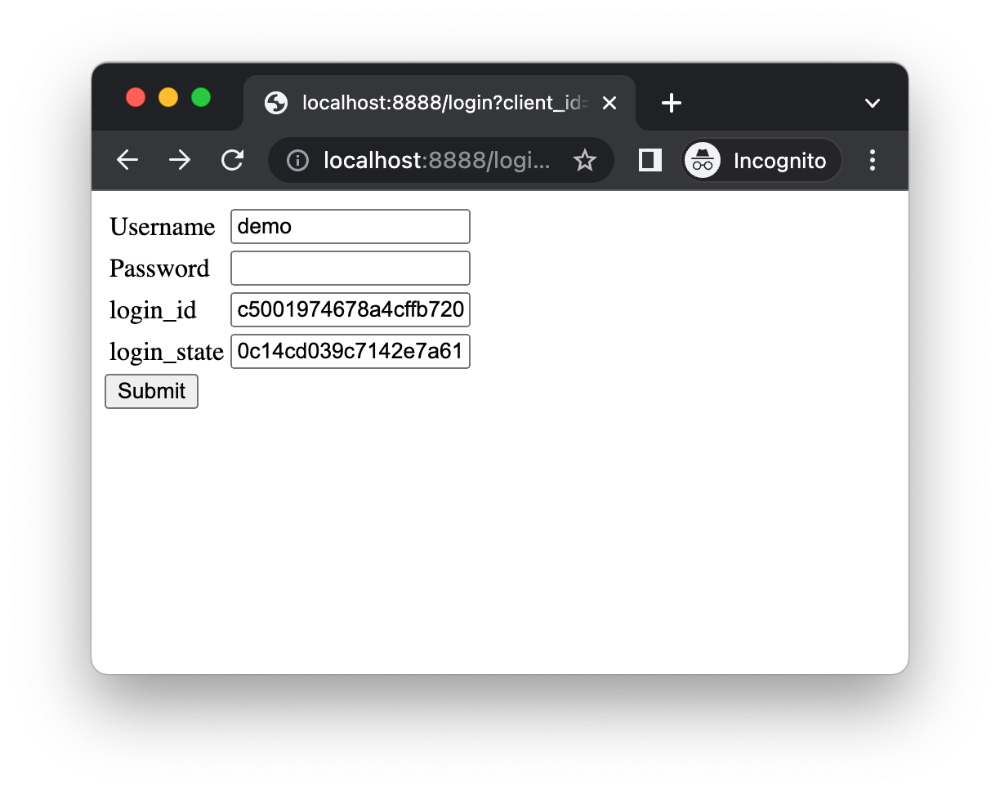

# Spring Boot Custom Identity Provider

Dummy IdP to verify we can hack our legacy authentication into a modern
auth flow using CloudEntity.



## Variables

You'll need to set these values in application.properties (which is .gitignore'd).

```properties
cloudentity.issuer-uri=
cloudentity.auth-server=
cloudentity.client-id=
cloudentity.client-secret=
```

## Running

We're expecting Java 17.

```shell
mvn spring-boot:run
```

You'll need a client app to perform a redirect to get you valid
`login_id` and `login_state` values on the login page. The default demo app 
in the workspace should suffice.


## Links

- [HOWTO Create Custom IDP in CloudEntity](https://cloudentity.com/developers/howtos/identities/custom-idp/)